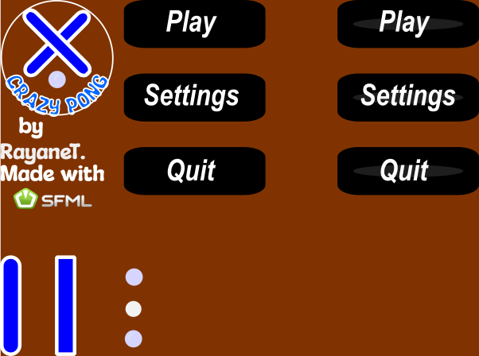

# Crazy Pong
Crazy Pong is an innovative reimagining of the classic ping-pong game,
designed to provide a fun and interactive experience for players of all ages.
This project was developed to challenge my programming skills and create an
engaging game.



## Table of Contents
Overview
Installation
Usage
Examples
Note

## Overview
Crazy Pong allows users to enjoy a modern twist on the classic ping-pong
game, featuring engaging multiplayer action and dynamic gameplay.

## Installation
Clone the repository:
```bash
git clone https://github.com/RyanTk03/ALX_Foundation_Portfolio_Project.git
cd CrazyPong/app
```

## Usage
Before running the game, ensure you have compatible versions of TGUI and SFML for your system.
Copy the lib and include folders from SFML and TGUI into deps/sfml and deps/tgui, respectively.
You also need cmake version 3.29 or higher and a C/C++ compiler.

1. **Compilation with CMake**

Create a directory where to build the program:
```bash
mkdir bin
cd bin
```

2. **Run CMake to configure and compile the project:**

```bash
cmake -DCMAKE_BUILD_TYPE=Debug "-DCMAKE_MAKE_PROGRAM=[your_make_program]" -G [your_generator(eg: Ninja)] -S ./ -B ./bin
```

3. **Run the game:**
```bash
cd bin
./CrazyPong
```

**Note:**
This project represents my learning journey in game development.
I created Crazy Pong to explore game mechanics and enhance my programming
skills. This experience allowed me to creatively solve problems and deepen
my understanding of game design.